# Nedir?
TDK Güncel Türkçe Sözlük gts.json.tar.gz dosyasını PyGlossary aracılığıyla StarDict, Kobo ve Kindle formatlarına çeviren bir Python betiği.

# Kullanımı
`python gts.py --help`
```
usage: gts.py [-h] [-j GTS_JSON] [--cekim-sozlukleri CEKIM_SOZLUKLERI [CEKIM_SOZLUKLERI ...]]
              [--cekim-sozlukleri-bicimleri CEKIM_SOZLUKLERI_BICIMLERI [CEKIM_SOZLUKLERI_BICIMLERI ...]]
              [--hunspell-sozlukleri HUNSPELL_SOZLUKLERI [HUNSPELL_SOZLUKLERI ...]] [-b {1,2,3,4}]

TDK Güncel Türkçe Sözlük gts.json.tar.gz dosyasını PyGlossary aracılığıyla StarDict, Kobo ve Kindle formatlarına
çeviren bir Python betiği.

options:
  -h, --help            show this help message and exit
  -j GTS_JSON, --json-tar-gz-path GTS_JSON
                        gts.json.tar.gz konumu.
  --cekim-sozlukleri CEKIM_SOZLUKLERI [CEKIM_SOZLUKLERI ...]
                        Sözcük çekimleri için kullanılacak ek sözlüklerin yolları. Birden fazla dosya yolunu boşluk
                        ile ayırın.
  --cekim-sozlukleri-bicimleri CEKIM_SOZLUKLERI_BICIMLERI [CEKIM_SOZLUKLERI_BICIMLERI ...]
                        --cekim-sozlukleri seçeneğinde kullanılan kaynakların biçimleri, birden fazla kaynak biçimini
                        boşluk ile ayırın.
  --hunspell-sozlukleri HUNSPELL_SOZLUKLERI [HUNSPELL_SOZLUKLERI ...]
                        Çekim bilgilerinin alınacağı Hunspell dosyalarından .aff ve .dic dosyasının konumu. Birden
                        fazla dosya yolunu boşluk ile ayırın.
  -b {1,2,3,4}, --cikti-bicimi {1,2,3,4}
                        Çıktı biçimi. StarDict = 1, StarDict (WebKit) = 2, Kobo = 3, Kindle = 4. StarDict biçimini
                        Webkit tabanlı bir görüntüleyicide kullanacaksanız (GoldenDict gibi) 2'yi seçin.
```
gts.json.tar.gz dosyasının ve sözcüklerin çekim bilgilerinin yer aldığı tr_TR.json.gz dosyasının betik ile aynı konumda olduğundan emin olun. (tr_TR.json.gz dosyasının nasıl oluşturulduğunu merak ediyorsanız [bağlantıyı](https://github.com/anezih/HunspellWordForms) takip edin. Üretilen json dosyasının [kaynak Hunspell dosyaları](https://github.com/titoBouzout/Dictionaries/blob/master/Turkish.txt).) (NOT: 2.4 versiyonu öncesinde kaynak olarak kullanılan gts.json.tar.gz dosyasına [buradan](https://github.com/ogun/guncel-turkce-sozluk) ulaşabilirsiniz)

Tüm biçimleri üretmek için betiği Powershell üzerinde şu şekilde çağırın:

```powershell
1..4 | % { python gts.py -b $_ }
```

`--cekim-sozlukleri` parametresi, var olan sözcük çekim bilgilerini hazırlanan sözlüğe ekleyebilmenizi sağlar. Bu parametreye çekim bilgileri olan StarDict sözlüklerinin yollarını gösterin. Birden fazla sözlük kullanılacaksa bunları boşluk ile ayırın. Bu parametrenin kullanılması durumunda `--cekim-sozlukleri-bicimleri`'nde kullandığınız sözlüklerin biçimini belirtin. Örnek:
```
python gts.py --cekim-sozlukleri "D:\sozlukler\kaynak_1.ifo" "D:\sozlukler\kaynak_2.ifo" --cekim-sozlukleri-bicimleri Stardict Stardict -b 1"
```

# 2.4.3 sürümü hakkında notlar
## İki tane olan StarDict biçimi hakkında<br>
2.4.3 sürümünde sözlük biçimlendirmesi StarDict'de ayrı css dosyasına taşınmıştır. Ancak KOReader yazılımının sözlük görüntüleyici arka ucu (MuPDF) HTML4 ve eşleniği CSS sürümü ötesinde görüntüleme yapamadığından StarDict sürümü basit ve biraz daha karmaşık CSS'li olmaz üzere ikiye ayrılmıştır. Sonunda *WebKit olan sürüm, görüntüleyici olarak WebKit veya daha modern bir arka uç kullanan yazılımlar içindir (Örneğin GoldenDict veya KOReader dşındaki her şey.)

## Kindle MOBI biçimi
2.4.2 sürümünde yer alan tanım içinde alan HTML bağlantılara yer verilmemiştir. Bu bağlantıların çalışıp çalışmadığını fiziki cihaz üzerinde deneyemediğimden bağlantıları bu sürüme dahil etmedim. 2.4.2 sürümünü deneyip, çalıştığını biri onaylayabilirse bu özellik tekrardan eklenebilir.

## Biçimlendirme esnekliği
Bu sürümde sözlükleri oluşturan betik tekrar en baştan yazıldı. Bunun nedeni biçimlendirmeyi olabilidiğince koddan ayırmak ve kolaylaştırmak. Bu aynı zamanda biçimlendirmeyi son kullanıcı açısından da daha kişiselleştirilebilir kılıyor. Eğer HTML ve CSS biliyorsanız. `tpl/` klasöründe yer alan dosyaları düzenledikten sonra betiği yeniden çalıştırarak tanım görünümlerini değiştirebilirsiniz. StarDict biçiminde programı yeniden çalıştırmaya gerek kalmadan sadece CSS dosyasını düzenlemek ise yeterli.

# Gerekli paketler
```
pip install pyglossary==4.6.1
pip install spylls
```
# Kobo sözlüğünü yükleme
* Sözlüğü doğrudan `KOBOeReader/.kobo/custom-dict` konumuna kopyalayın.
* Kaynak ve detaylı açıklama için [buraya](https://pgaskin.net/dictutil/dicthtml/install.html) başvurun.

<details>
<summary><h1>Ekran Görüntüleri (Eski)</h1></summary>
<h2>V1</h2>

|                                                          |                                                           |
|:--------------------------------------------------------:|:---------------------------------------------------------:|
|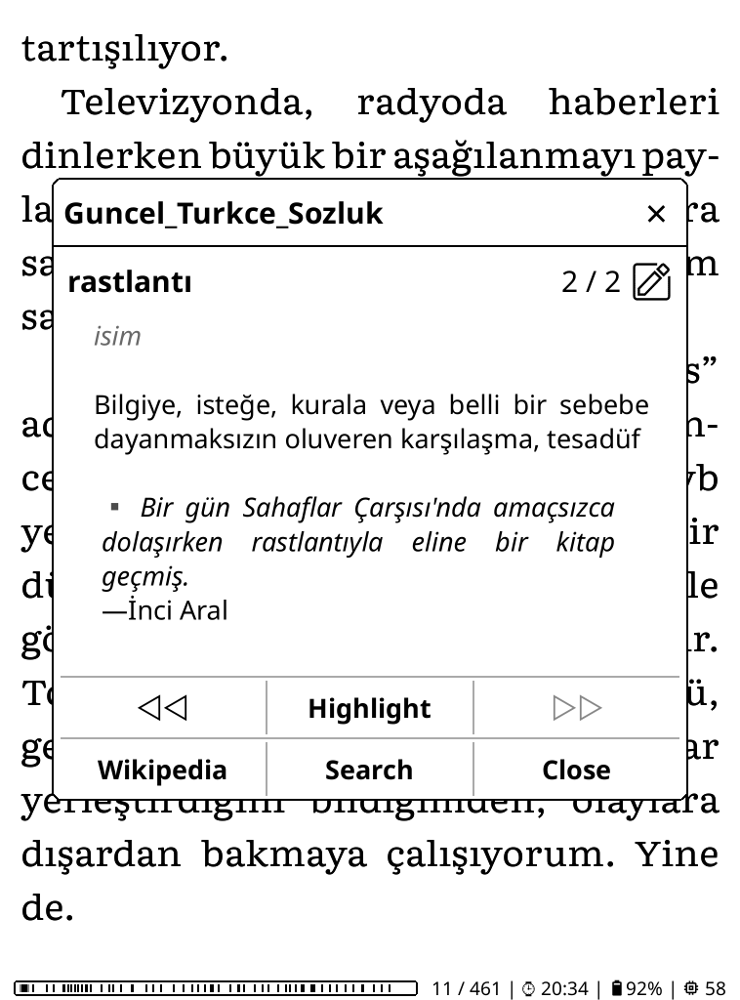| |
|KOReader üzerinde Stardict/1                              |KOReader üzerinde Stardict/2                               |
|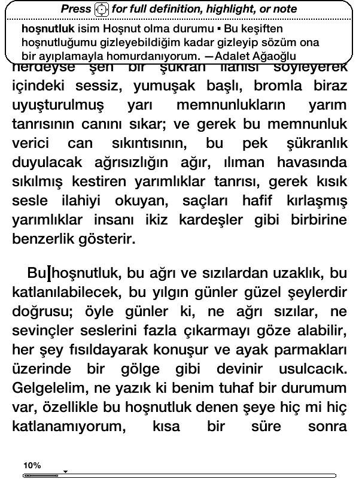       |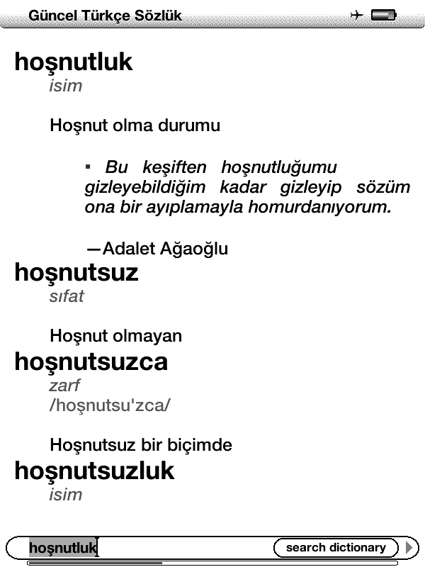        |
|Kindle 4 sözlük ön izleme penceresi                       |Kindle 4 sözlük detaylı görünüm                            |
|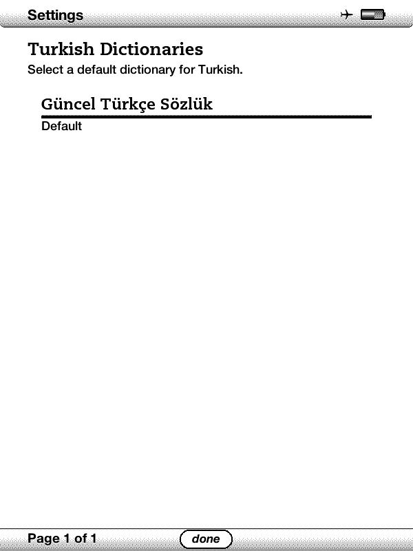       |                                                           |
|Kindle 4 yüklü Türkçe sözlükler listesi                   |                                                           |

<h2>V2</h2>

**Çekimlenmiş sözcük aransa dahi kök sözcük görüntüleniyor.**

|                                             |                                                   |
|:-------------------------------------------:|:-------------------------------------------------:|
|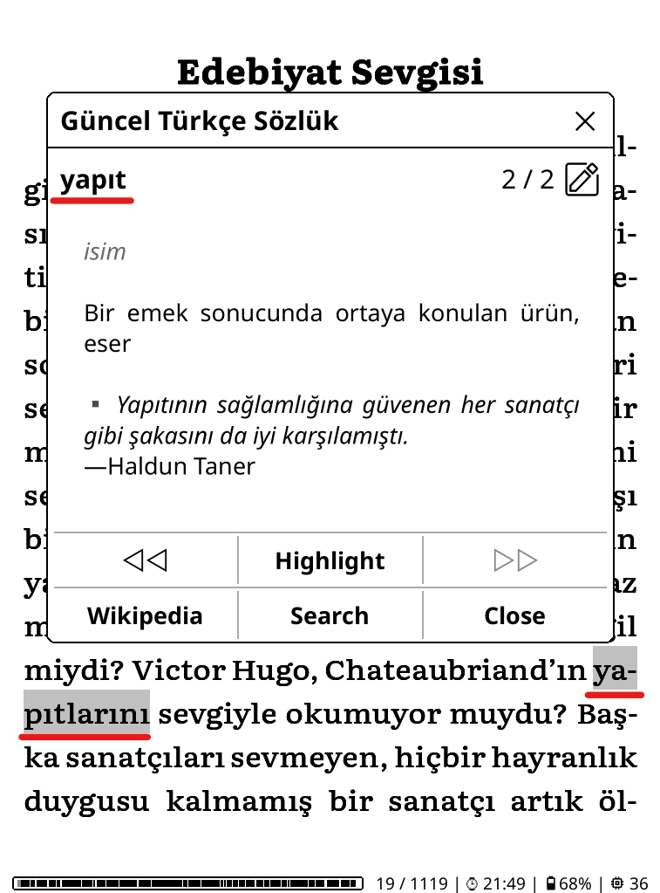|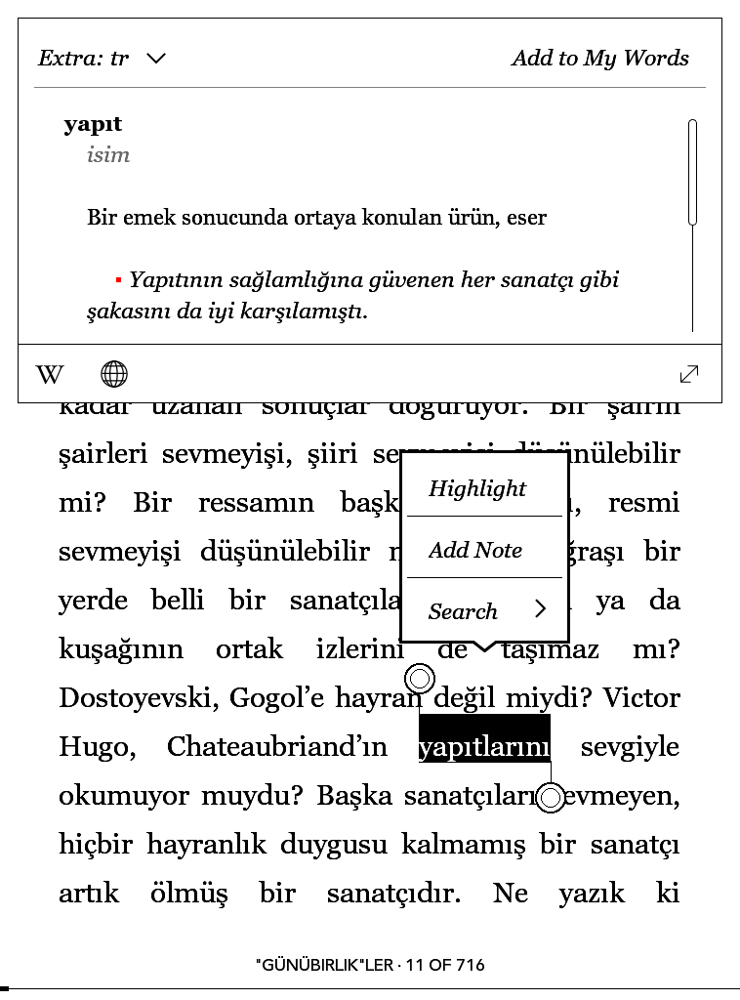 |
|V2 - KOReader üzerinde Stardict              |V2 - Kobo                                          |

<h2>V2.1 - Girdilerin Eksik Tanımları Eklendi, Kindle için MOBI dosyası üretildi</h2>

|                                                                  |                                                                              |
|:----------------------------------------------------------------:|:----------------------------------------------------------------------------:|
|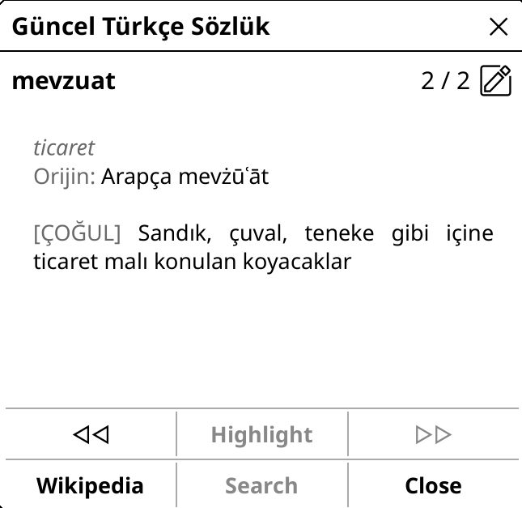|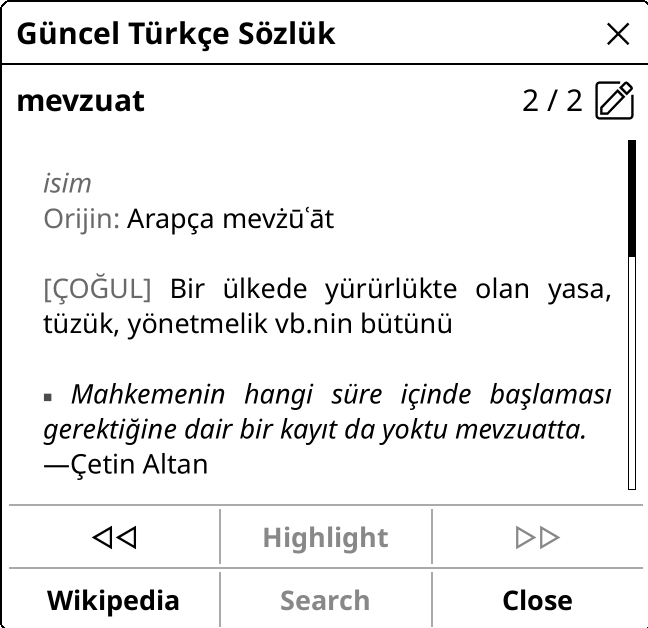 |
|**V2 - Eksik tanımlı bir girdi**                                  |**V2.1 - Girdinin eksik tanımları eklendi/1**                                 |
|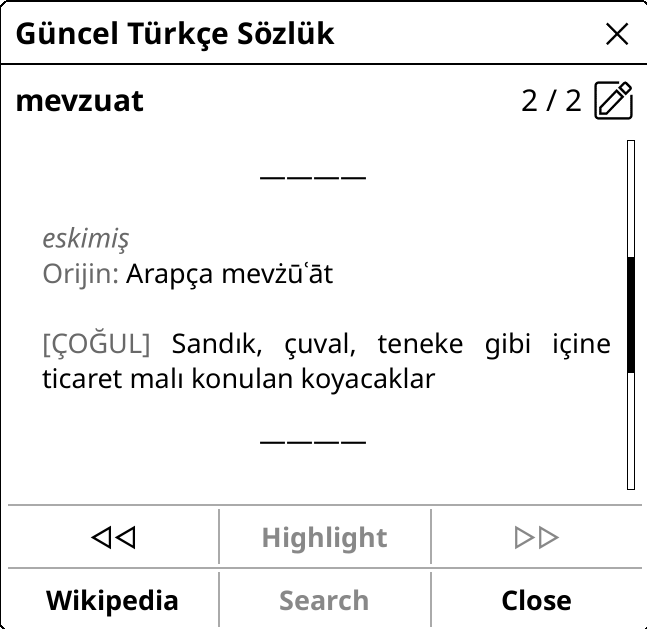|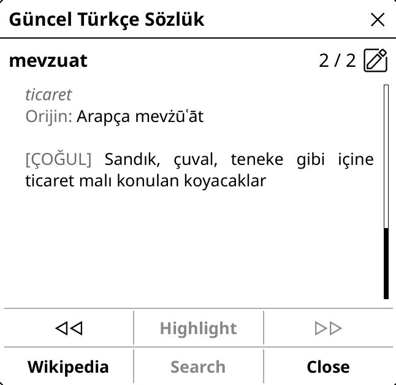|
|**V2.1 - Girdinin eksik tanımları eklendi/2**                     |**V2.1 - Girdinin eksik tanımları eklendi/3**                                 |
|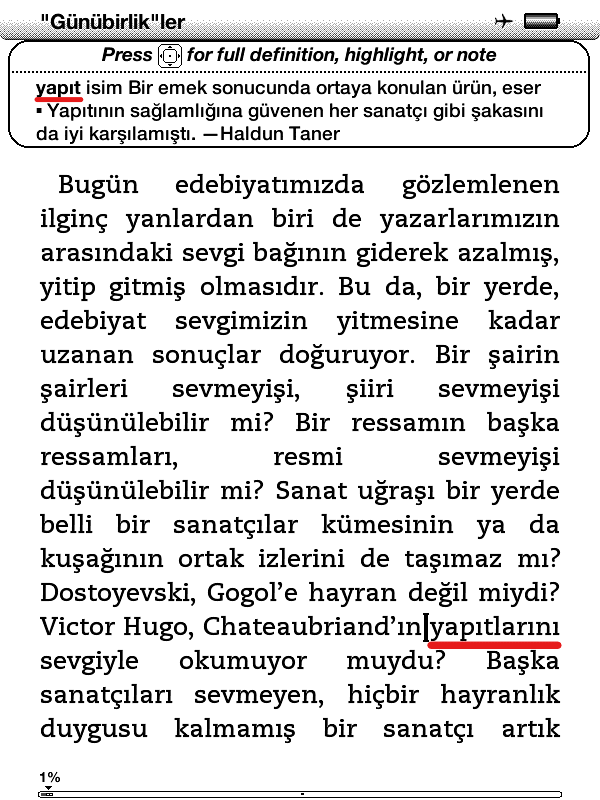|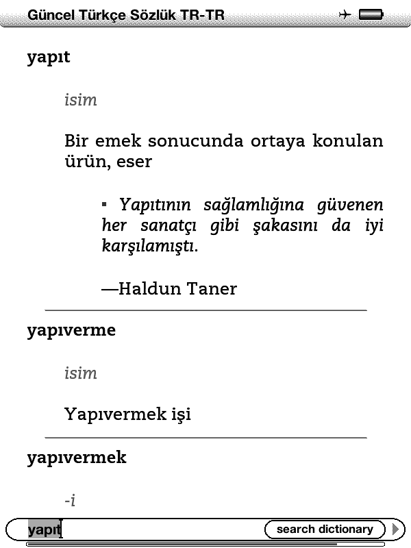|
|**V2.1 PyGlossary aracılığıyla Kindle için derlendi,<br/> çekimlenmiş sözcüklerde sonuç dönüyor**| **Kindle üzerinde tanımın detaylı görünümü**|

</details>